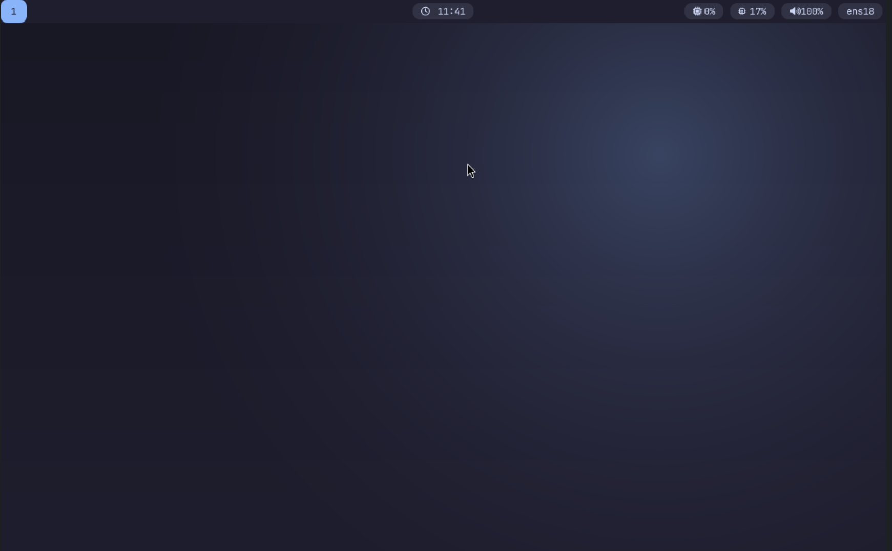

# Arch Sway Modern

A modern Wayland desktop setup for Arch Linux built around **Sway**, themed with the
Catppuccin Mocha palette. Includes Waybar, Wofi, Foot, Mako, greetd/tuigreet, a Fish
shell environment, and an automated installer.

## Screenshot



## Requirements

- A fresh **Arch Linux** base install (booted, with network access)
- A regular user with `sudo` privileges — **do not run the installer as root**
- Internet connection (the installer runs `pacman -Syu`)

## Install

Clone the repo and run the installer from its root directory:

```bash
git clone <this-repo> arch-sway-modern
cd arch-sway-modern
./installer.sh
```

`installer.sh` runs the numbered scripts in `scripts/` in order. Each stage is
independent, so you can also run them individually while iterating.

| Order | Script | What it does |
|-------|--------|--------------|
| 00 | `00-check.sh` | Pre-flight checks: not root, `pacman`/`sudo` present, warns if not UEFI |
| 01 | `01-packages.sh` | Installs every package listed in `packages/*.conf` |
| 02 | `02-services.sh` | Enables NetworkManager, greetd, bluetooth, power-profiles-daemon, and PipeWire user services |
| 03 | `03-configs.sh` | Deploys Sway config, `environment.d`, and greetd config to `/etc/greetd/` |
| 04 | `04-theme.sh` | Copies Waybar, Wofi, Foot, Mako, and GTK theming into `~/.config` |
| 05 | `05-shell.sh` | Installs Fish + Starship config and sets Fish as the default shell |
| 06 | `06-cleanup.sh` | Removes orphaned packages and trims the pacman cache |

After it finishes, **reboot**. greetd/tuigreet will present a login prompt; select
your user and Sway starts automatically.

## What goes where

| Source | Installed to |
|--------|--------------|
| `configs/sway/` | `~/.config/sway/` |
| `configs/waybar/`, `wofi/`, `foot/`, `mako/` | `~/.config/<app>/` |
| `configs/gtk/settings.ini` | `~/.config/gtk-3.0/settings.ini` |
| `configs/fish/` | `~/.config/fish/` |
| `configs/starship/starship.toml` | `~/.config/starship/starship.toml` |
| `system/environment.d/sway.conf` | `~/.config/environment.d/sway.conf` |
| `system/greetd/config.toml` | `/etc/greetd/config.toml` |

## Key bindings (Sway)

`Mod` is the **Super** (Windows) key.

| Binding | Action |
|---------|--------|
| `Mod + Return` | Terminal (Foot) |
| `Mod + d` | App launcher (Wofi) |
| `Mod + b` | Browser (Firefox) |
| `Mod + q` | Close window |
| `Mod + f` | Fullscreen toggle |
| `Mod + Shift + Space` | Float toggle |
| `Mod + h/j/k/l` | Focus left/down/up/right |
| `Mod + Shift + h/j/k/l` | Move window |
| `Mod + 1..9` | Switch workspace |
| `Mod + Shift + 1..3` | Move window to workspace |
| `Mod + Shift + r` | Reload Sway |
| `Mod + Shift + e` | Exit Sway (with confirmation) |

## Customizing

- **Wallpaper** — replace `configs/sway/wallpaper.png` with your own image (any
  resolution; it's scaled with `fill`). It's referenced by `output * bg` in
  `configs/sway/output.conf`.
- **Cursor (Bibata)** — the GTK config uses `Bibata-Modern-Ice`, which is AUR-only.
  Install it with an AUR helper: `yay -S bibata-cursor-theme-bin` (or `paru`). The
  cursor falls back to the default theme until then.
- **Colors / apps** — edit `configs/sway/variables.conf` (modifier key, terminal,
  launcher, browser, theme colors).
- **Packages** — add or remove entries in `packages/*.conf`; the installer reads
  every `.conf` in that folder.

## Repository layout

```
.
├── installer.sh            # Entry point, runs scripts/ in order
├── scripts/                # 00–06 install stages
├── packages/               # Package lists (base, desktop, terminal, theme)
├── configs/                # Dotfiles: sway, waybar, wofi, foot, mako, fish, ...
└── system/                 # System-level configs (environment.d, greetd)
```
